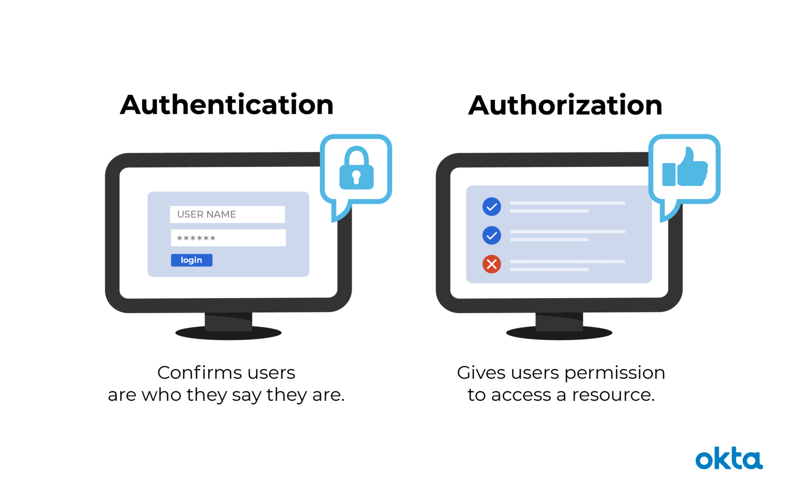

## **Authentication And Authorization**
***
[Source](https://www.okta.com/identity-101/authentication-vs-authorization/#:~:text=Authentication%20and%20authorization%20might%20sound,permission%20to%20access%20a%20resource.)
[Source](https://medium.com/datadriveninvestor/authentication-vs-authorization-716fea914d55)
[Video Source](https://www.youtube.com/watch?v=j8Yxff6L_po)
#### What Is Authentication?
Authentication is the act of validating that users are whom they claim to be. This is the first step in any security process. 

Giving someone permission to download a particular file on a server or providing individual users with administrative access to an application are good examples of authentication.

Complete an authentication process through:

- Passwords: Usernames and passwords are the most common authentication factors. If a user enters the correct data, the system assumes the identity is valid and grants access.
- One-time pins: Grant access for only one session or transaction.
Authentication apps. Generate security codes via an outside party that grants access.
- Biometrics: A user presents a fingerprint or eye scan to gain access to the system.

###### - Single Factor Authentication: 
This is the simplest form of authentication method which requires a password to grant user access to a particular system such as a website or a network. The person can request access to the system using only one of the credentials to verify one’s identity. For example, only requiring a password against a username would be a way to verify a login credential using single- factor authentication.
###### Two Factor Authentication:
This authentication requires a two- step verification process which not only requires a username and password, but also a piece of information only the user knows. Using a username and password along with a confidential information makes it that much harder for hackers to steal valuable and personal data.
###### Multi Factor Authentication: 
This is the most advanced method of authentication which requires two or more levels of security from independent categories of authentication to grant user access to the system. This form of authentication utilizes factors that are independent of each other in order to eliminate any data exposure. It is common for financial organizations, banks, and law enforcement agencies to use multiple- factor authentication.

#### What Is Authorization?
Authorization in a system security is the process of giving the user permission to access a specific resource or function. This term is often used interchangeably with access control or client privilege.

In secure environments, authorization must always follow authentication. Users should first prove that their identities are genuine before an organization’s administrators grant them access to the requested resources.

##### few ways of Authorization:
  Basic Auth --
    providing username and password for each and every request you
      make

Token based
  generate a long token just one time
  and use that for the rest of the request

similar to the visitor tag you get when you go to certain
  restricted areas

API KEY ---
Bearer Token --

#### Authentication vs. Authorization

| something | Authentication | Authorization |
|--|--|--|
| What does it do? | Verifies credentials  | Grants or denies permissions |
|How does it work? |Through passwords, biometrics, one-time pins, or apps | Through settings maintained by security teams |
| Is it visible to the user? | Yes | No |
| It is changeable by the user? | Partially | No |
| How does data move? | Through ID tokens | Through access tokens |