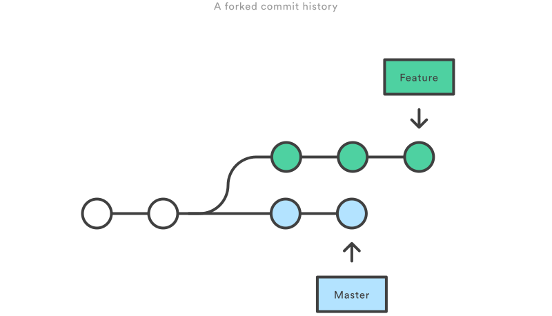
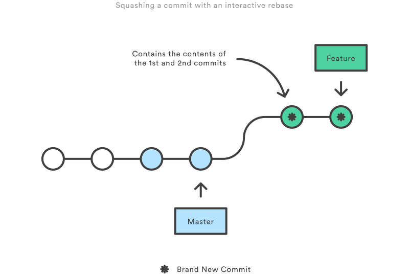

## GIT notes
***
[source](https://www.atlassian.com/git/tutorials/merging-vs-rebasing)
#### Merging vs Rebasing
##### The Golden Rule of Rebasing reads: “Never rebase while you're on a public branch.”

Consider what happens when you start working on a new feature in a dedicated branch, then another team member updates the master branch with new commits. This results in a forked history, which should be familiar to anyone who has used Git as a collaboration tool.

##### The Merge Option
The easiest option is to merge the master branch into the feature branch using something like the following:
`git checkout feature git merge master`
Or, you can condense this to a one-liner:
`git merge feature master`
This creates a new “merge commit” in the feature branch that ties together the histories of both branches, giving you a branch structure that looks like this:

Merging is nice because it’s a non-destructive operation. The existing branches are not changed in any way. This avoids all of the potential pitfalls of rebasing (discussed below).

On the other hand, this also means that the feature branch will have an extraneous merge commit every time you need to incorporate upstream changes. If master is very active, this can pollute your feature branch’s history quite a bit. While it’s possible to mitigate this issue with advanced git log options, it can make it hard for other developers to understand the history of the project.

##### The Rebase Option
As an alternative to merging, you can rebase the feature branch onto master branch using the following commands:

`git checkout feature git rebase master`
This moves the entire feature branch to begin on the tip of the master branch, effectively incorporating all of the new commits in master. But, instead of using a merge commit, rebasing re-writes the project history by creating brand new commits for each commit in the original branch.

The major benefit of rebasing is that you get a much cleaner project history. First, it eliminates the unnecessary merge commits required by git merge. Second, as you can see in the above diagram, rebasing also results in a perfectly linear project history—you can follow the tip of feature all the way to the beginning of the project without any forks. This makes it easier to navigate your project with commands like git log, git bisect, and gitk.

But, there are two trade-offs for this pristine commit history: safety and traceability. If you don’t follow the Golden Rule of Rebasing, re-writing project history can be potentially catastrophic for your collaboration workflow. And, less importantly, rebasing loses the context provided by a merge commit—you can’t see when upstream changes were incorporated into the feature.

##### Interactive Rebasing

Interactive rebasing gives you the opportunity to alter commits as they are moved to the new branch. This is even more powerful than an automated rebase, since it offers complete control over the branch’s commit history. Typically, this is used to clean up a messy history before merging a feature branch into master.

To begin an interactive rebasing session, pass the i option to the git rebase command:
`git checkout feature git rebase -i master`
This will open a text editor listing all of the commits that are about to be moved:
`pick 33d5b7a Message for commit #1 pick 9480b3d Message for commit #2 pick 5c67e61 Message for commit #3`
This listing defines exactly what the branch will look like after the rebase is performed. By changing the pick command and/or re-ordering the entries, you can make the branch’s history look like whatever you want. For example, if the 2nd commit fixes a small problem in the 1st commit, you can condense them into a single commit with the fixup command:
`pick 33d5b7a Message for commit #1 fixup 9480b3d Message for commit #2 pick 5c67e61 Message for commit #3`

When you save and close the file, Git will perform the rebase according to your instructions, resulting in project history that looks like the following:

Eliminating insignificant commits like this makes your feature’s history much easier to understand. This is something that git merge simply cannot do.

### The Golden Rule of Rebasing

Once you understand what rebasing is, the most important thing to learn is when not to do it. The golden rule of git rebase is to never use it on public branches.

For example, think about what would happen if you rebased master onto your feature branch:

The rebase moves all of the commits in master onto the tip of feature. The problem is that this only happened in your repository. All of the other developers are still working with the original master. Since rebasing results in brand new commits, Git will think that your master branch’s history has diverged from everybody else’s.

The only way to synchronize the two master branches is to merge them back together, resulting in an extra merge commit and two sets of commits that contain the same changes (the original ones, and the ones from your rebased branch). Needless to say, this is a very confusing situation.

So, before you run git rebase, always ask yourself, “Is anyone else looking at this branch?” If the answer is yes, take your hands off the keyboard and start thinking about a non-destructive way to make your changes (e.g., the git revert command). Otherwise, you’re safe to re-write history as much as you like.